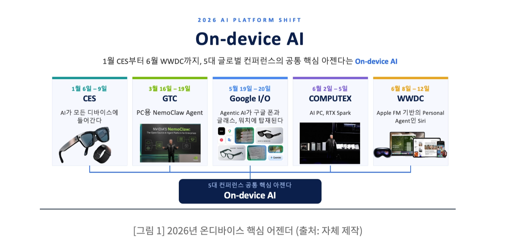
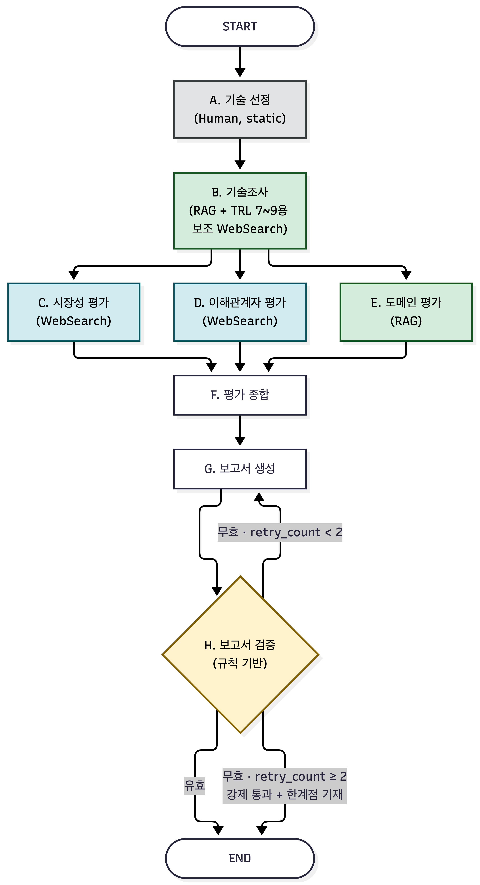
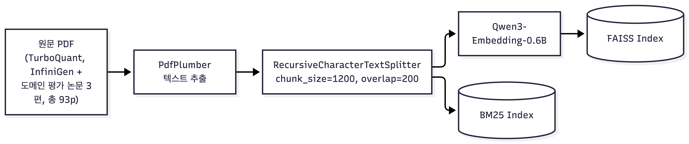
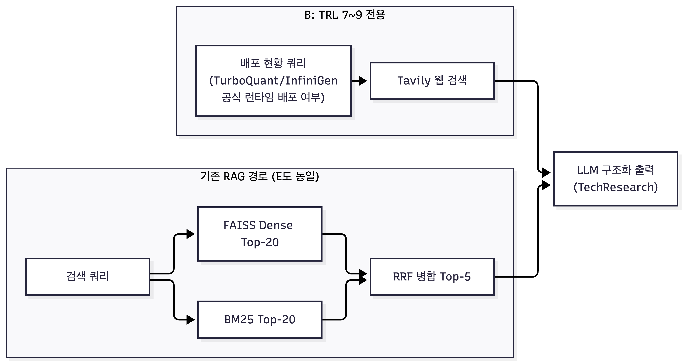

## Subject

본 프로젝트는 KV cache 최적화 기술을 소프트웨어, 하드웨어 두 진영에서 선정하여, 시장·이해관계자·도메인 관점에서 평가하는 Agentic RAG를 개발하는 프로젝트이다.

***

## Domain Background



2026년 들어 **온디바이스** AI는 **1월 CES부터 6월 WWDC**까지 이어지는 **5대 글로벌 컨퍼런스의 공통 의제**로 자리잡았다.
Apple은 WWDC에서 파운데이션 모델 기반 개인 에이전트로 Siri를 재설계하며 클라우드로 질의를 보내는 대신 기기가 먼저 이해하고 판단하는 구조로의 전환을 알렸고, Samsung은 연말까지 약 2억 대의 갤럭시 **AI 폰에 실시간 번역과 생성형 이미지 편집**을 탑재하겠다고 발표했다. IDC는 2025년 GenAI 스마트폰 출하량이 3억 7천만 대를 넘어 전체 스마트폰의 약 30%를 차지할 것으로 전망했다.

이 흐름의 **근본 제약은 메모리**다. 클라우드 GPU와 달리 스마트폰·엣지 기기는 배터리, 발열, 제한된 RAM 안에서 LLM을 구동해야 하는데, 컨텍스트가 길어질수록 KV cache가 모델 가중치보다 더 큰 메모리를 요구하는 구조적 병목이 있다. 업계에서 이르면 **2026년 모바일 HBM 시장이 열릴 것이라는 전망이 나올 만큼**, 온디바이스 메모리 병목 해소는 반도체 업계 전체의 화두가 되어 있다.

이것이 이론적 논의에 그치지 않는다는 근거로 두 가지 실사용 사례를 확인했다.

* **Apple의 온디바이스 VLM 프레임워크 MLX-VLM**은 이미 **TurboQuant 기반 KV cache 압축을 4비트 양자화**와 함께 지원 기능으로 포함시켰다. 소프트웨어 압축 접근이 실제 온디바이스 제품 생태계에 편입되고 있다는 뜻이다.

* 2026년 3월 24일 Google이 **TurboQuant를 ICLR 2026 채택 논문**으로 발표하며 AI 메모리 효율의 돌파구로 소개하자, 그 다음날 **삼성전자와 SK하이닉스 주가가 각각 4.8%, 5.9% 하락했다**는 보도가 나왔다.
  KV cache 압축 기술 하나가 국내 메모리 반도체 업계 주가에까지 영향을 미쳤다.

그래서 본 프로젝트는 이 병목을 서로 다른 철학으로 푸는 두 기술, 곧 **캐시 자체를 줄이는 압축**과 **메모리** **계층을 넓히는 오프로딩**을 같은 기준 위에 놓고 비교한다. 평가 도메인은 OnDevice AI이다. 자원 제약과 전력 민감이 겹쳐 관점에 따라 평가가 가장 크게 갈리는 환경이기 때문이다.

***

## Selected Technologies

선정 기준은 개입 시점을 배포 단계로 한정한 것이다. KV cache 최적화는 **학습 단계에서 아키텍처를 재설계**하는 방식(DeepSeek-V2의 MLA 등)과 **학습이 끝난 모델에 사후 적용하는 방식**으로 나뉜다. 아래 두 기술은 재학습 없이 임의의 사전학습 모델에 적용 가능해 같은 개입 시점을 전제로 한 공정 비교가 성립한다.

* **SW : TurboQuant** (압축, 비트폭 가변 양자화 / 품질무손실 기준 3.5비트, KV cache 압축 목적으로는 2.5\~3.5비트 구간을 논문에서 제시, Apple MLX-VLM은 4비트 설정으로 채택)

  * *경쟁 후보 KIVI가 비대칭 2비트 양자화라는 특정 설정의 경험적 유효성을 제시*하는 데 그치는 반면, **TurboQuant**는 Shannon 소스 코딩 이론의 정보이론적 하한에 얼마나 근접하는지를 수학적으로 증명하며 2.5\~3.5비트 전 구간에서 근사 최적 왜곡률을 보장한다.

  * ICLR 2026 채택, Apple MLX-VLM 실채택, 발표 직후의 **시장 반응까지 확인**되어 **현시점 산업적 화제성이 가장 뚜렷**하다. DeepSeek-V2는 학습 단계 개입이라 위 기준으로 제외했다.

* **HW : InfiniGen** (메모리 오프로딩, 선택적 KV 프리페치)

  * 다음 레이어의 attention 패턴을 미리 예측해 필**요한 KV 항목만 선택적으로 프리페치하는 방식**으로, 특수 하드웨어 없이 **순수 소프트웨어 메커니즘만으로 host 메모리 오프로딩 문제**를 해결한다.

  * 함께 검토한 ITME와 PIM/CXL은 각각 GPU 서버 간 RDMA 분산 스토리지와 CXL 3.0 메모리 풀링을 전제한다. **둘 다 스마트폰·엣지 기기에 물리적으로 존재하지 않는 하드웨어를 요구해 온디바이스 실운용 환경 게이트를 통과하지 못한다**. InfiniGen은 CPU·GPU·NPU가 메모리를 공유하는 모바일 SoC의 계층형 메모리 구조에도 개념적으로 이식 가능해, 하드웨어 후보 셋 중 유일하게 온디바이스 도메인에서 원리 수준의 논의가 가능하다.

평가 도메인은 OnDevice AI이며, 기준 기기는 RAM 8GB 스마트폰이다. 앱 몫 4GB에서 탑재 LLM(Qwen3-4B, 4비트) 가중치 2.5GB를 뺀 1.5GB를 KV cache 예산으로 잡는다.

***

## Overview

* Objective : 하나의 기술을 복수 관점에서 비교 평가

* Method : Multi-Agent(Distributed) + Advanced RAG

* Tools : **RAG 검색(BM25 + FAISS Hybrid, RRF)**, **Web Search(Tavily)**, **규칙 기반 보고서 검증**

***

## Features

* **PDF 자료 기반 정보 추출**

  * 논문 5편 93쪽을 PdfPlumber로 추출해 단일 계층으로 청킹한 뒤 BM25와 FAISS 인덱스를 병렬 구축한다.

  * 기술조사 에이전트는 선정 기술 원문 2편(43쪽)을, 도메인 평가 에이전트는 도메인 기준 문헌 3편(50쪽)을 각각 별도 리트리버로 읽는다.

* **웹 검색 기반 시장·이해관계자 평가**

  * 논문에 없는 배포·채택·발화 근거는 Tavily 검색으로 수집한다.

* **보고서 자동 검증 루프**

  * 생성된 보고서에 필수 장이 있는지, 개조식과 소결 블록과 번호 인용 형식을 지켰는지, 금칙 표현이 들어갔는지를 규칙으로 검사해 위반 시 재작성을 지시한다.

  * 최대 2회까지 재시도하고 상한에 도달하면 검증 실패 사실을 담은 감사 기록을 보고서 안에 남긴 채 종료한다. 검증에 실패한 보고서가 통과 표시로 제출되는 일을 막기 위한 장치다.

* **확증 편향 방지 전략**

  평가가 한쪽으로 기우는 것을 막기 위해 네 가지를 설계에 넣었다.

  * **대칭 질의**: 시장성과 이해관계자 에이전트는 질의 템플릿 한 벌을 두 기술에 기술명만 바꿔 던진다.
    한쪽에만 비판을 묻거나 한쪽에만 지지를 묻는 구조가 생기지 않게 하기 위함이다. 이해관계자 평가는 **지지 방향과 비판 방향을 두 기술 모두에 같은 문형으**로 던져 **찬반 대칭까지 맞춘다.**

  * **근거 소유권 분리**: 문서·저장소·규격의 기록은 시장성 관점이, 사람의 발화는 이해관계자 관점이 소유한다. 같은 사실을 두 관점이 각각 근거로 세어 한 근거가 두 번 반영되는 일을 막는다.

  * **근거 없음을 열세로 쓰지 않음**: **근거를 찾지 못하면 근거 없음으로 적고 판정에서 불리하게 쓰지 않는다.**
    종합 단계에서 항목별로 두 기술의 근거 유무를 나란히 기록해, 근거 없음이 한쪽에만 몰렸으면 그 자체를 편향 신호로 드러낸다.

  * **우열 어휘 금지**: 관점별 판정과 종합 서술에 우수, 우월, 우위, 권장, 추천을 쓰지 않는다. 관점 단위 승자 필드를 두지 않고, 대신 압축 유리 조건 / 확장 유리 조건 / 조건 의존 / 차이 없음 / 판단보류 다섯 값으로
    방향만 요약한다. 정형 필드는 두 기술 값을 나란히 적게 강제하는 공통 구조로 통일해, 한쪽만 채운 출력이 스키마 단계에서 나올 수 없게 했다. 보고서 검증 노드가 관점별 평가와 시사점 장에서 금칙 표현을 실제로 검사한다.

***

## Tech Stack

* Framework : LangGraph

* LLM/Generator : gpt-4.1 (기술조사, 도메인 평가, 보고서 생성)

* LLM/Judge : gpt-4.1-mini (시장성, 이해관계자, 평가 종합)

* Retrieval : BM25 top-20 과 FAISS Dense top-20 을 RRF로 병합해 top-5 사용, 리랭커 없음

* Embedding : Qwen/Qwen3-Embedding-0.6B

**LLM을 두 모델로 나눈 이유**는 **노드별 난이도가 다르기 때문**이다. 시장성과 이해관계자 판정은 웹 검색 결과를 정해진 카테고리 값으로 분류하는 작업이라 mini로 충분한 반면, 기술조사와 도메인 평가는 원문 논문을 읽고 다단계로 추론해야 하고 보고서 생성은 네 관점 결과를 하나의 일관된 문서로 조립해야 해 품질 손실 위험이 크다.

임베딩 모델은 MTEB Leaderboard(Multilingual: Korean·English) 기준으로 골랐다. 본 설계는 **sparse 트랙을BM25로 별도 운용**하므로 d**ense 단독 측정치인 Retrieval 점수가 실제 사용 조건과 일치**하는데, 이 조건에서 Qwen3-Embedding-0.6B는 32위(60.46), bge-m3는 79위(53.63)로 격차가 있다\*. 같은 계열 4B가 점수는 더 높으나 파라미터가 6배 이상 커 **재인덱싱 속도를 고려해 0.6B를 선정**했다.\*

***

## Agents

| Agent       | 도구                  | 선행 노드      | 하는 일                                                                                                   |
| :---------- | :------------------ | :--------- | :----------------------------------------------------------------------------------------------------- |
| A. 기술 선정    | Human 기반            | START      | **선정 기술**과 **평가 도메인**을 상수로 확정                                                                          |
| B. 기술조사     | RAG + 보조 Web Search | A          | 선정 기술 원문 2편(43쪽)을 읽어 개요·적용 범위·한계를 뽑고 TRL을 판정. 1~~6단계는 원문으로, 공식 배포와 상용 지원에 해당하는 7~~9단계만 웹 검색 2건을 보조로 쓴다 |
| C. 시장성 평가   | Web Search          | B          | 시장 규모·성장성, 상용화·채택 현황, 생태계 지지, 표준화 유무를 판정                                                               |
| D. 이해관계자 평가 | Web Search          | B          | 경쟁 기술 진영, 도입 기업·개발자, 투자 업계가 각각 무엇이라고 말했는지를 판정                                                          |
| E. 도메인 평가   | RAG                 | B          | 도메인 기준 문헌 3편(50쪽)을 근거로 메모리 예산, 정확도, 지연, 전력·발열 네 항목을 기술당 판정하고 작동점 간 역전 여부를 서술                           |
| F. 평가 종합    | 없음                  | C, D, E    | 네 관점 라벨을 모아 **상충 지점을 명시적**으로 드러낸다                                                                      |
| G. 보고서 생성   | 없음                  | F 또는 H 재진입 | 네 관점의 판정과 원자료, 네 갈래 참고문헌을 합쳐 **보고서를 조립**                                                               |
| H. 보고서 검증   | 규칙 기반               | G          | 필수 장, 개조식·소결·번호 인용 형식, 금칙 표현을 검사. 무효면 G로 되돌린다                                                          |

TRL은 전담 에이전트 없이 B의 산출물 안에 들어간다. 참고 목차의 관점별 평가에는 시장, 이해관계자, 도메인만 있고 TRL은 기술 개요 장에 속하기 때문이다. TRL 5부터는 환경 게이트를 걸어, 온디바이스 기기에서 측정한 것과 온디바이스 런타임에 들어간 것만 인정해 값을 다시 매긴다.

***

## Architecture



**전처리 파이프라인** (B·E가 공유)



**검색 파이프라인**



***

## Directory Structure

```
├── data/papers/            대상 논문 5편 (스크립트로 내려받는다, 저장소에 없음)
├── notebooks/              에이전트별 개발 노트북 (각 노드의 원본)
│   ├── 01_agent_B_tech_research.ipynb
│   ├── 02_agent_CD_market_stakeholder.ipynb
│   ├── 03_agent_E_domain.ipynb
│   ├── 04_agent_FGH_synthesis_report_validate.ipynb
│   └── 05_full_graph_run.ipynb
├── src/
│   ├── config.py           문서 경로, 모델 이름, 선정 기술, 분석 배경 문단
│   ├── state.py            State Schema
│   ├── schemas.py          에이전트 구조화 출력 (Pydantic)
│   ├── prompts.py          평가 기준을 옮긴 프롬프트
│   ├── ingest.py           전처리와 하이브리드 검색 파이프라인
│   ├── node_utils.py       노트북 공용 헬퍼
│   ├── nodes_b.py          노트북 01이 생성
│   ├── nodes_cd.py         노트북 02가 생성
│   ├── nodes_e.py          노트북 03이 생성
│   ├── nodes_fgh.py        노트북 04가 생성
│   └── graph.py            그래프 배선
├── output/                 평가 결과 저장
├── scripts/download_papers.sh
├── main.py                 실행 스크립트
└── README.md
```

노드 구현은 노트북이 원본이고 src/nodes\_.py는 생성물이다. 각 노트북 마지막 저장 셀이 그 노트북에서 정의한 함수를 그대로 긁어 해당 .py를 통째로 다시 쓴다. 그래서 src/nodes\_.py를 직접 고치면 다음에 누군가 저장 셀을 실행할 때 그 수정이 사라진다. 고칠 일이 있으면 노트북에서 고치고 저장 셀을 다시 실행할 것. 저장 셀은 덮어쓰기 전후의 최상위 심볼을 비교해 사라진 이름이 있으면 경고를 찍는다.

***

## Usage

```bash
pip install -r requirements.txt
bash scripts/download_papers.sh
```

저장소 루트에 `.env`를 만들어 키 두 개를 채운다.

```
OPENAI_API_KEY=...
TAVILY_API_KEY=...
```

* 한 번에 전체 실행

  한 번에 끝까지 돌리려면 다음을 쓴다.

  ```bash
  python main.py
  ```

* 노드별 실습

  노드별로 나눠 보려면 notebooks/01\~04를 각각 열어 위에서 아래로 실행한다. 배선 테스트 셀까지는 API 키 없이 돌아가고 실제 LLM 테스트 셀부터 키가 필요하다. 넷 다 저장을 마친 뒤 notebooks/05를 열면 전체 그래프를 조립해 실행한다. 05의 배선 재확인 셀은 가짜 객체로 전 구간을 돌려보므로 키 없이도 그래프가 성한지 확인할 수 있다.

실행이 끝나면 `output/final_report.md`에 보고서가 생성된다.
첫 실행은 임베딩 모델(약 1.2GB)을 내려받느라 몇 분 걸릴 수 있다.

***

## Contributors

* 박서윤 : 프로젝트 구조 설계, State·스키마·프롬프트 정의, 전처리 및 하이브리드 검색 파이프라인, 그래프 기초 코드 구축

* 이지영 : 기술조사 에이전트(B), 검색 편중 수정, 온디바이스 기준 TRL 판정 보강

* 박태식 : 도메인 평가 에이전트(E), 보고서 형식 검증 규칙, 노드별 LLM 이원화

* 이헌준 : 시장성 에이전트(C), 이해관계자 에이전트(D), 평가 종합·보고서 생성·보고서 검증(F/G/H)

***

## 핵심 포인트

같은 문제(KV cache 메모리 병목)를 서로 다른 철학으로 푸는 두 기술을 **비교**하는 프로젝트이다 보니, 설계 전반이 "누가 이기는가"가 아니라 "어느 한쪽으로도 기울지 않게 만드는 장치"에 맞춰져 있다.

* **편향을 프롬프트가 아니라 스키마로 막는다**
  "우열을 판정하지 말라"는 지시만으로는 LLM이 결국 한쪽을 편든다. 모든 판정 필드를 `TechStatus{turboquant, infinigen}`로 고정해 두 기술 값을 항상 나란히 출력하게 강제하고, label 자체도 "우수/우월/권장" 같은 서열 어휘를 아예 선택지에서 뺐다(압축 유리 조건 / 확장 유리 조건 / 조건 의존 / 차이 없음 / 판단보류). 방지책을 프롬프트 한 곳에 몰지 않고 **스키마 → 프롬프트 → 규칙 기반 검증(H)** 세 층에 나눠 심었다.

* **"근거 없음"을 열세로 오인하지 않게 추적한다**
  한쪽 기술의 공개 자료가 적으면 LLM은 자연히 그 방향을 불리하게 서술하려는 경향이 있다. evidence\_status를 명시적으로 두고, F(평가 종합) 단계에서 항목×기술 근거 유무를 따로 집계해 "근거 없음이 한쪽에만 몰렸다"는 사실 자체가 편향 신호로 보고서에 드러나게 했다.

* **State를 하나를 공유하되, 노드별로 완전히 분리해 병렬 개발을 실제로 가능하게 했다**
  market\_eval/stakeholder\_eval/domain\_eval과 그 근거 리스트까지 쓰는 노드가 정확히 1개씩이라 reducer 없이도 동시 쓰기 충돌이 설계상 발생하지 않는다. 노트북 4개를 팀원이 동시에 열어 독립적으로 개발·저장할 수 있었다.

***

## Lessons Learned

* **LLM-as-Judge 재검증 루프(B'/E')를 시간 관계상 못 넣었다**\
  **이게 남긴 진짜 한계:**
  B(기술조사)·E(도메인평가)가 검색해온 근거를 LLM이 구조화 스키마에 맞춰 "그럴듯하게" 채우면, 그 내용이 논문을 정확히 반영했는지 검증하는 단계가 없다. H(보고서 검증)는 챕터 존재·서열 표현 같은 **형식**만 규칙으로 검사할 뿐 **근거가 실제로 맞는지(사실성)** 는 못 걸러낸다. 즉 "구조는 맞는데 내용은 틀린" 보고서가 그대로 통과될 수 있다는 게 현재 파이프라인이 못 막는 지점이다. 시간이 더 있었다면 검색된 근거와 판정 문장을 LLM-as-Judge로 대조해, 근거에 없는 내용이 들어가면 재검색·재판정하도록 만드는 게 다음 우선순위였을 것이다.

* **"RAG가 잘 나온다"는 착각. LLM-as-Judge이 필요한 이유**
  초반엔 B·E가 뽑아주는 판정이 그럴듯하게 잘 나와서 "역시 이 도메인엔 RAG가 잘 맞는구나" 싶었다. 그런데 검증 삼아 간단한 LLM-as-Judge 스크립트를 만들어 붙여봤더니, 겉보기엔 멀쩡했던 판정 중 상당수가 사실은 `근거 없음`으로 롤백돼야 하는 경우였다. 원인을 추적해보니, 논문에서 그 판정에 맞는 단락을 못 찾으면 LLM이 **Pydantic 스키마 필드의 `description`에 예시로 적어둔 문장을 실제 답인 것처럼 그대로 베껴서** 냈다. "못 찾으면 근거 없음이라고 써라"는 프롬프트 지시문만으로는 이걸 못 걸렀다. description의 예시 문구 자체가 형식은 완벽하게 맞아서, 단순 규칙 검사로는 실제 근거인지 예시를 베낀 건지 구분이 안 됐다.

  여기서 두 가지를 배웠다. 첫째, "이 분야는 RAG가 잘 맞는다"는 판단이 맞더라도 그게 검색이 실제로 관련 근거를 찾아준다는 보장은 아니다. 고정된 논문 몇 편으로 커버 안 되는 최신·광범위한 사실은 RAG만으로 밀어붙이지 말고 Web Search를 꼭 함께 고려해야 한다(실제로 B는 그렇게 하이브리드로 구성했다). 둘째, "겉보기엔 잘 작동하는 것 같다"는 확신은 검증 전까진 근거가 없다. 이런 실패 양상은 프롬프트 지시문만으로는 안 막히고, LLM-as-Judge 같은 별도 검증 단계를 실제로 붙여봐야만 드러난다.
  
* **BM25 vs 학습된 sparse(SPLADE·bge-m3) — sparse를 굳이 나눠 쓴 이유를 다시 짚어봤다**
  BM25는 글자가 정확히 겹쳐야만 잡는다. "차"로 검색했는데 문서에 "자동차"만 있으면 못 찾는다.
  SPLADE 같은 학습된 sparse는 MLM으로 전체 vocabulary에 가중치를 예측해, 입력에 없는 단어(동의어)
  까지 일부 점수를 줄 수 있다(term expansion).

  ELSER(Elastic)·SPLADE 지원(Pinecone) 같은 현업 사례를 보면 학습된 sparse로 갈아타는 이유가
  검색 품질(동의어 커버리지)뿐만이 아니다. Sparse 벡터는 BM25든 학습된 것이든 "단어: 가중치" 형태라
  같은 역색인 인프라에 그대로 얹을 수 있고, bge-m3처럼 한 모델이 dense·sparse를 동시에 내면
  관리할 모델·인프라가 줄어든다

  <br />


